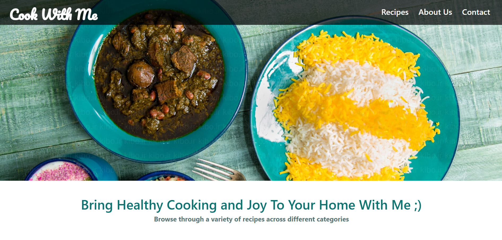

# Cook With Me

## Description
**Cook With Me** is a recipe website built using **Next.js**. The website allows users to explore various recipes, view detailed ingredients and instructions. The project aims to provide a clean, modern, and responsive platform that makes cooking easier and more enjoyable for users. It uses Next.js to ensure fast performance, SEO optimization, and easy navigation. You can reach the website at [Cook With Me](https://saminlabbaf.github.io/Cook-With-Me/) 

## Prerequisites
Before you begin, ensure you have the following software installed:

- **Node.js** (version 14 or higher): A JavaScript runtime required to build and run Next.js applications. You can download it from [here](https://nodejs.org/).
  
- **npm** (Node Package Manager): It is included with Node.js and is used to manage project dependencies.

To verify if Node.js and npm are installed, run the following commands:

```sh
node -v
npm -v  
```

If both are installed correctly, the version numbers will be displayed.

## Installation & Setup
To set up and run the project locally, follow these steps:

### 1. Clone the repository:

Open your terminal and run:

```sh
git clone https://github.com/SaminLabbaf/Cook-With-Me.git
```

### 2. Navigate to the project directory:

Change into the project directory:

```sh
cd Cook-With-Me
```

### 3. Install the required dependencies:

Inside the project folder, run the following command to install all necessary dependencies:

```sh
npm install
```

### 4. Run the development server:

Start the development server by running:

```sh
npm run dev
```

Your app will be accessible at http://localhost:3000.
